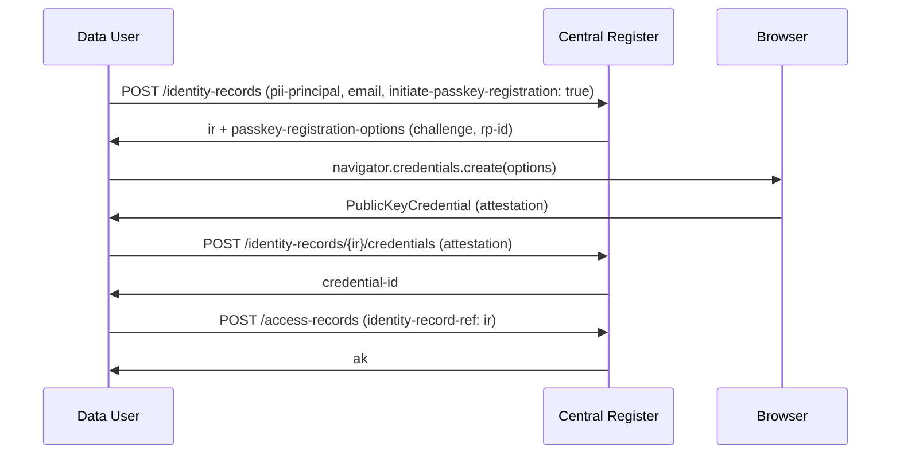
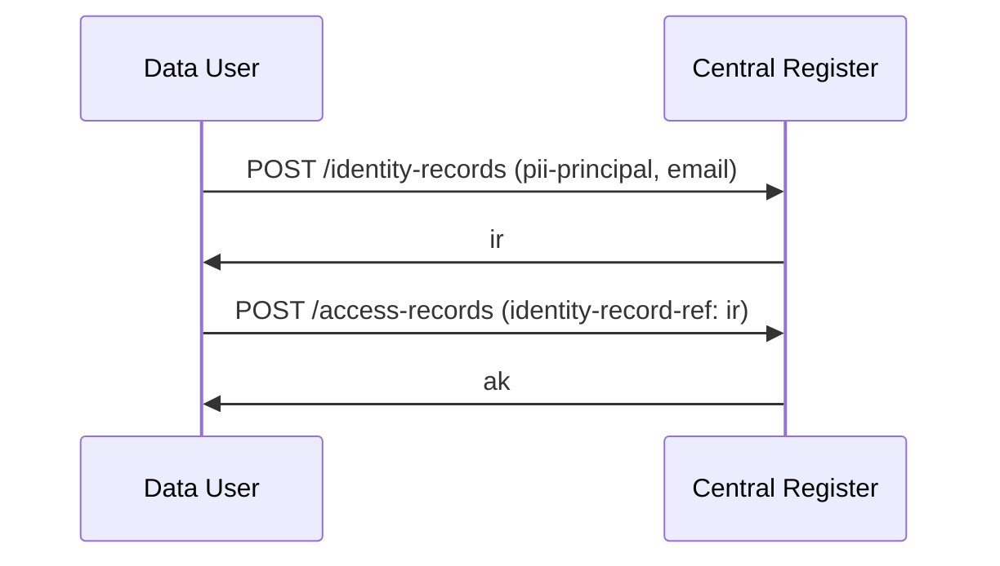
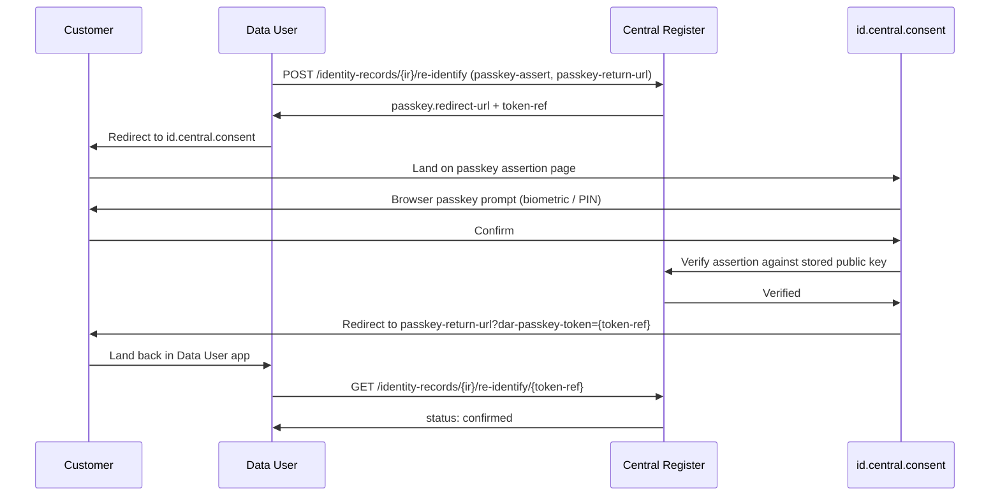
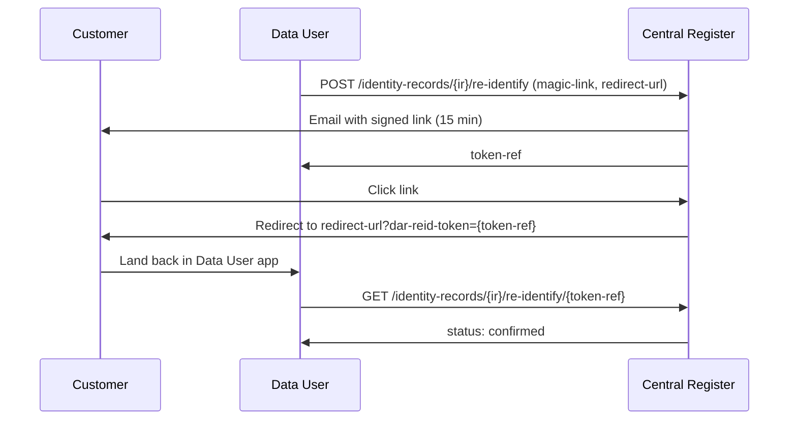
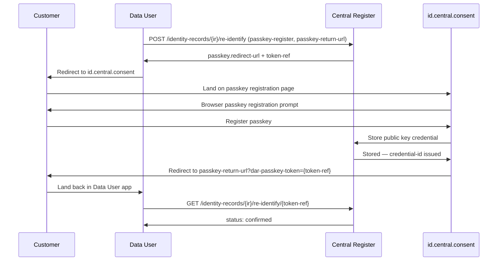
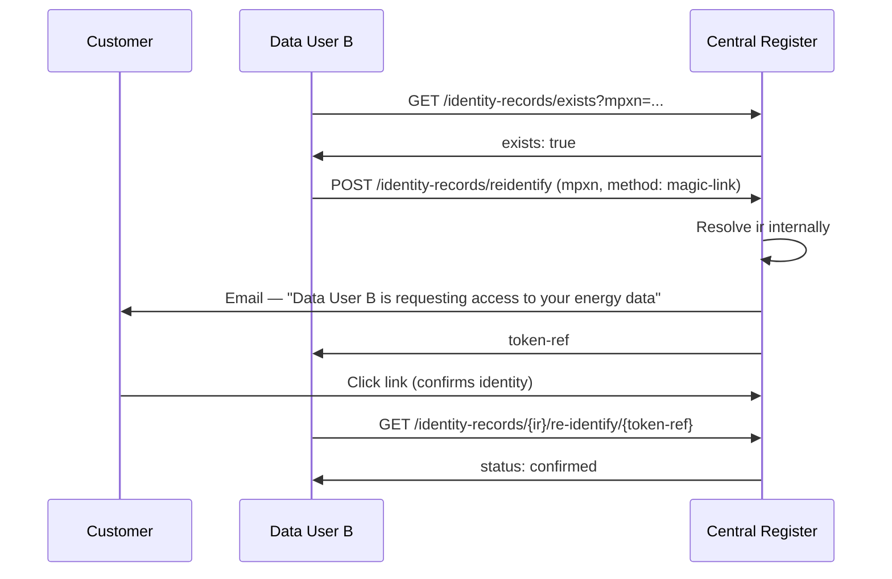
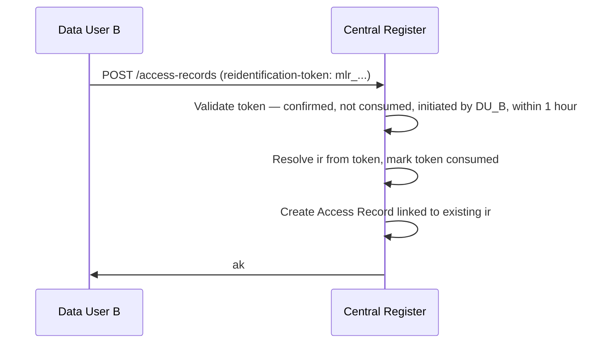

## Overview

An **Identity Record** holds the person-property relationship for a consent or access registration — who the individual is and their occupancy of the meter point. It is intentionally separate from the **Access Record**, which holds only the legal basis, purpose, and data scope.

This separation serves two goals:

1. **Privacy by design** — the unauthenticated `GET /access-records/{ak}` endpoint used by Data Providers to verify access never exposes PII. Identity evidence is accessible only to authenticated Data Users.
2. **Re-identification** — returning customers can be reconnected to their existing Identity Record using a passkey or magic link, without re-collecting all their details from scratch.

## What an Identity Record Holds

| Field | Description |
|-------|-------------|
| `pii-principal` | MPxN, move-in date, and optionally the property address |
| `expressed-by` | Whether consent was given by the data subject or an authorised representative |
| `principal-verification` | How the Controller verified the customer's identity (method, outcome, reference) |
| `email` | Stored as a one-way hash — never returned in plaintext. Enables magic-link re-identification and email-based lookup |
| `credentials` | Registered passkey public keys (metadata only — credential ID, registered-at, transports). Never returned in full |

The `ir` key issued on creation is referenced from `record-metadata.identity-record-ref` on the linked `AccessRecord`.

## Relationship to Access Records

```
AccessRecord
└── record-metadata
    ├── controller          (who is accessing)
    └── identity-record-ref → ir_...
                                │
                          IdentityRecord
                          ├── pii-principal   (MPxN, address, move-in)
                          ├── expressed-by
                          ├── principal-verification
                          ├── email (hashed)
                          └── credentials[]
```

A single Identity Record can be referenced by multiple Access Records — for example if the same customer has given consent to multiple Controllers managed by the same Data User, or if a consent is renewed and a new Access Record is created.

An Identity Record created by one Data User can also be referenced by another Data User, provided the customer has completed a cross-DUID re-identification challenge. See [Cross-DUID Re-identification](#cross-duid-re-identification) below.

## Creating an Identity Record

Call `POST /identity-records` before registering an Access Record. Supply the `ir` key in `record-metadata.identity-record-ref` when calling `POST /access-records`.

Optionally supply `email` and/or set `initiate-passkey-registration: true` at creation time to enable re-identification from the start.



If you don't need passkey registration at creation time, skip `initiate-passkey-registration` and just use the `ir` key directly:



## Re-identification

When a customer returns — to renew consent, onboard with a new Controller, or access the Customer Portal — the Data User can re-identify them against an existing Identity Record rather than collecting all their details again.

### Step 1: Find the Identity Record

Look up the Identity Record by MPxN or email:

```
GET /identity-records?mpxn=1234567890123
GET /identity-records?email=customer@example.com
```

Email lookup matches against the stored hash. Results are scoped to the authenticated Data User.

### Step 2: Choose a Re-identification Method

Three methods are available, in order of preference:

| Method | When to use | Flow |
|--------|-------------|------|
| **Passkey assertion** | Customer has a registered passkey | Redirect to `id.central.consent` → customer taps biometric → redirected back |
| **Magic link** | Email stored, no passkey (or new device) | Register sends email → customer clicks → Data User confirms |
| **Passkey registration** | No passkey registered — enrol a new one | Redirect to `id.central.consent` → customer registers passkey → redirected back |

### Passkey Assertion (returning customer)

The WebAuthn ceremony always takes place on `id.central.consent` — the register's own origin — so the browser's origin checks are satisfied. The Data User initiates with a redirect and gets a confirmation token back.



### Magic Link (email fallback)



Without a `redirect-url`, the customer lands on a confirmation page at `central.consent` and the Data User polls `GET /identity-records/{ir}/re-identify/{token-ref}` every 3–5 seconds.

### Enrolling a New Passkey (passkey-register)

Use `passkey-register` when the customer has no passkey on the record or is using a new device. The flow is identical to assertion but runs a WebAuthn registration ceremony instead, storing a new public key on the Identity Record before confirming.



## Cross-DUID Re-identification

A customer who has already been identified by one Data User (Data User A) can authorise a second Data User (Data User B) to link a new Access Record to the same Identity Record — without Data User B ever seeing the `ir` key or any PII.

This avoids collecting the customer's details twice and is appropriate when a customer is onboarding with a new supplier, adding a third-party service, or switching between registered organisations.

**The `ir` key never leaves the register in this flow.** Data User B works only with an MPxN and a confirmation token. The register resolves the `ir` internally.

### Security Model

The cross-DUID flow requires the customer to actively complete a re-identification challenge initiated by Data User B. This ensures:

- A rogue Data User cannot look up an `ir` by MPxN and reuse it — they can only initiate a challenge, not complete one
- The challenge page on `id.central.consent` displays Data User B's name, so the customer knows exactly who is requesting access and can refuse
- The confirmation token is single-use, scoped to the initiating DUID, and expires after one hour
- Without customer completion, the token cannot be used

### Step 1: Check Existence

Data User B checks whether an Identity Record exists for the customer's MPxN:

```
GET /identity-records/exists?mpxn=1234567890123
```

Returns `{ "exists": true }` or `{ "exists": false }`. No `ir` key or PII is returned.

If `exists: false`, Data User B should create a new Identity Record via the standard flow.

### Step 2: Initiate Re-identification

Data User B initiates the re-identification challenge using only the MPxN. The register resolves the `ir` internally and dispatches the challenge to the customer:

```
POST /identity-records/reidentify
{
  "mpxn": "1234567890123",
  "method": "magic-link"
}
```

The challenge page or email displays Data User B's `display-name` from their registered account profile, so the customer sees who is asking.



The same flow applies for passkey methods — the challenge page on `id.central.consent` shows Data User B's name before the customer is prompted for biometric confirmation.

### Step 3: Create the Access Record

Data User B passes the confirmed `token-ref` as `reidentification-token` in the standard `POST /access-records` request, omitting `identity-record-ref` (the register injects it from the token):

```json
{
  "reidentification-token": "mlr_9f8e7d6c5b4a9f8e7d6c5b4a",
  "record-metadata": {
    "schema-version": "1.0",
    "controller-arrangement": { ... }
  },
  "notice": { ... },
  "processing": { ... },
  "access-event": { ... }
}
```

The register validates the token is confirmed, was initiated by Data User B, has not been used before, and was issued within the last hour — then links the new Access Record to the existing Identity Record.



## Managing Credentials

### Adding a Passkey at Identity Record Creation

Set `initiate-passkey-registration: true` and supply `passkey-return-url` when calling `POST /identity-records`. The response includes a `passkey-registration-redirect` — redirect the customer immediately to complete registration on `id.central.consent`.

### Adding a Passkey After Creation

Call `POST /identity-records/{ir}/re-identify` with `method: passkey-register` to initiate a registration redirect for an existing record.

### Removing a Passkey

```
DELETE /identity-records/{ir}/credentials/{credentialId}
```

If no credentials remain, passkey re-identification is unavailable. Magic link remains available if an email is stored.

### Multiple Passkeys

A customer may register passkeys on multiple devices — each `passkey-register` ceremony produces a separate `credential-id`. All are stored on the same Identity Record and any can be used for assertion.

## Why the Ceremony Happens on id.central.consent

WebAuthn binds a passkey to the **Relying Party origin** — the domain where `navigator.credentials.create()` or `navigator.credentials.get()` is called. If the Data User's app at `app.bright-energy.com` tried to run the ceremony directly, the browser would refuse because the RP ID (`central.consent`) doesn't match the calling origin.

By hosting the ceremony on `id.central.consent`, the register owns the RP entirely. This means:

- Passkeys work consistently across all Data Users and on the Customer Portal
- A customer registered a passkey through one Data User's flow can use it to authenticate on the portal directly
- The Data User never handles raw WebAuthn credential material — they only deal with redirect URLs and confirmation tokens
- In cross-DUID flows, the ceremony page can display the initiating Data User's name, giving the customer full context before committing

## GDPR Erasure

Identity Records can be anonymised in response to an Art. 17 erasure request. All PII (`pii-principal`, `email`, `credentials`, `principal-verification`) is permanently destroyed. The `ir` key is retained so the linked Access Records remain auditable.

```
DELETE /identity-records/{ir}
```

**Pre-condition:** all Access Records linked to this Identity Record must be in `REVOKED` or `EXPIRED` state. The register returns `409` if any active Access Record would be orphaned.

After anonymisation:
- `GET /identity-records/{ir}` returns the record with all PII fields null and `anonymised-at` set
- `POST /identity-records/{ir}/re-identify` returns `409`
- The linked Access Records remain intact for audit purposes

## Security Notes

**Email is stored as a one-way hash.** The register cannot retrieve the plaintext email address. It is used only for lookup matching and magic-link dispatch routing. It is never returned in any API response.

**Passkey public keys are never returned.** `GET /identity-records/{ir}` returns only credential metadata (ID, registered-at, transports). The public key material is held internally and used only for assertion verification.

**`submitted` in `principal-verification` must always be redacted.** The register must never hold a full card number, account number, or other unredacted sensitive credential. Use masked values such as `XXXX-XXXX-XXXX-4242`.

**Identity Records are scoped to the creating Data User** for direct access. A Data User cannot look up, read, or modify another Data User's Identity Record directly. Cross-DUID linking is only possible via a confirmed customer re-identification challenge — the `ir` is never exposed to the second Data User.
