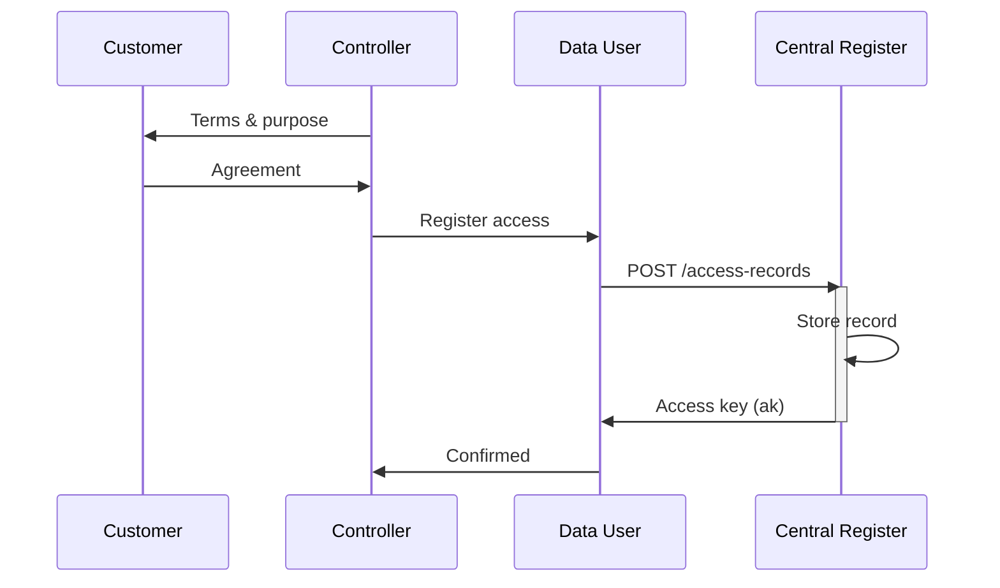
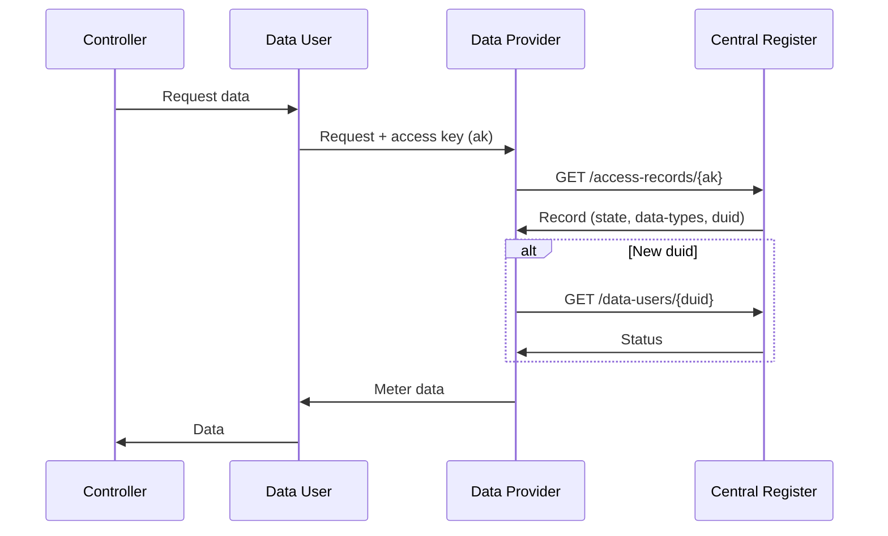
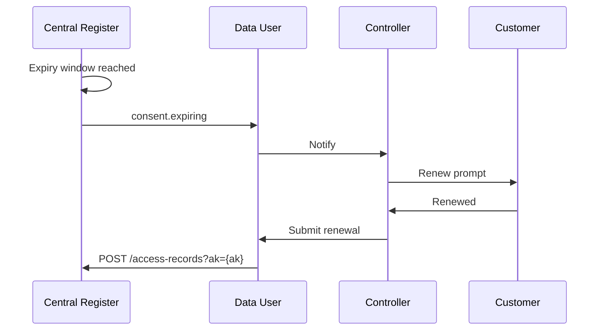
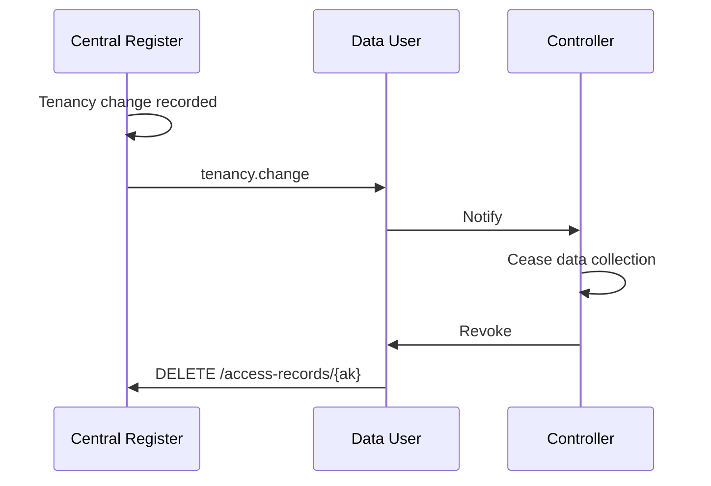

 
<Warning>This is a practical, lightweight alternative to the full Consumer Consent Solution architecture. It records all lawful access to customer meter data — not just consent — and is presented as an open design for industry feedback.</Warning>
 
The register is not a consent register exclusively. It records access under any lawful basis — consent, legitimate interests, public task, legal obligation, or contract. The Central Register holds the registration only; it does not validate or enforce the legal basis claimed by the Controller 

<Note>The Controller and Data User may be the same entity</Note>
 
Key flows:
- [Registering an Access Record](#registering-an-access-record)
- [Verifying an Access Record](#verifying-an-access-record)
- [Lifecycle Notifications](#lifecycle-notifications)
 
## Registering an Access Record
 
The Controller obtains lawful basis from the Customer (or asserts it internally for non-consent bases) and registers it with the Central Register via the Data User API. The register stores the record and returns an access key.
 
For consent-based records, the Data User captures the Customer's agreement — including identity verification — before calling the register. The register stores what it is told; it does not re-verify the consent.
 

 
Historic records and migrations from existing consent stores can be submitted using the same endpoint.
 
## Verifying an Access Record
 
Before releasing meter data, the Data Provider verifies the access key and — on first encounter with a new Data User — looks up the Data User's status in the directory.
 

 
The Data Provider is responsible for mapping the `duid` to its own platform access controls. It must deny data release if the access record is not `ACTIVE`, if the access key has expired, or if the Data User's status is `suspended` or `terminated`.
 
## Lifecycle Notifications
 
Controllers can subscribe to webhook events to manage the access record lifecycle proactively. Both events are delivered to the same callback URL; the `event-type` field distinguishes them.
 
### Consent Expiry
 
Fired when a consent-based access record is within the configured notification window (default 30 days) of its expiry date. The Controller should prompt the Customer to renew before access lapses.
 

 
### Change of Tenancy
 
Fired when a Change of Tenancy is recorded against an MPxN that has one or more active access records. The Controller must cease data collection and revoke the affected records. No new occupant PII is included in the payload.
 

 
## Change Log
 
| Version | Date | Summary |
|---------|------|---------|
| 0.0.8 | 2026-03-18 | Added EDP directory lookup (`GET /data-users/{duid}`) and webhook subscriptions for consent expiry and tenancy change events. |
| 0.0.7 | 2026-03-11 | Initial release. |
